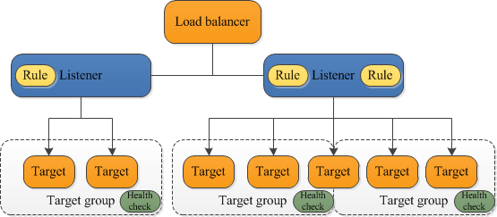

# Create EC2 Instance Application Load Balancer

## Task

> The Nautilus DevOps team is currently working on setting up a simple application on the AWS cloud. They aim to establish an Application Load Balancer (ALB) in front of an EC2 instance where an Nginx server is currently running. While the Nginx server currently serves a sample page, the team plans to deploy the actual application later.
> 1. Set up an Application Load Balancer named `xfusion-alb`.
> 2. Create a target group named `xfusion-tg`.
> 3. Create a security group named `xfusion-sg` to open port `80` for the public.
> 4. Attach this security group to the ALB.
>
> The ALB should route traffic on port 80 to port 80 of the `xfusion-ec2` instance. Make appropriate changes in the default security group attached to the EC2 instance if necessary.

## Research

* Application Load Balancer:
  * https://docs.aws.amazon.com/elasticloadbalancing/latest/application/introduction.html
  * https://docs.aws.amazon.com/elasticloadbalancing/latest/application/application-load-balancer-getting-started.html
* Target Groups
  * https://docs.aws.amazon.com/elasticloadbalancing/latest/application/load-balancer-target-groups.html
* Security Groups:
  * https://docs.aws.amazon.com/AWSEC2/latest/UserGuide/working-with-security-groups.html#creating-security-group
  * https://docs.aws.amazon.com/cli/latest/reference/ec2/create-security-group.html
  * https://docs.aws.amazon.com/cli/latest/reference/ec2/authorize-security-group-ingress.html



## Steps

For GUI, follow the steps at https://docs.aws.amazon.com/elasticloadbalancing/latest/application/application-load-balancer-getting-started.html.

```bash
# Test the Load Balancer
curl -v http://xfusion-alb-gui-118637334.us-east-1.elb.amazonaws.com/
```

<details>
  <summary><b>NOTE:</b> Click me for output.</summary>

```html
*   Trying 44.195.114.217:80...
* Connected to xfusion-alb-gui-118637334.us-east-1.elb.amazonaws.com (44.195.114.217) port 80 (#0)
> GET / HTTP/1.1
> Host: xfusion-alb-gui-118637334.us-east-1.elb.amazonaws.com
> User-Agent: curl/7.74.0
> Accept: */*
>
* Mark bundle as not supporting multiuse
< HTTP/1.1 200 OK
< Date: Wed, 04 Sep 2024 23:33:55 GMT
< Content-Type: text/html
< Content-Length: 615
< Connection: keep-alive
< Server: nginx/1.24.0
< Last-Modified: Fri, 13 Oct 2023 13:33:26 GMT
< ETag: "65294726-267"
< Accept-Ranges: bytes
<
<!DOCTYPE html>
<html>
<head>
<title>Welcome to nginx!</title>
<style>
html { color-scheme: light dark; }
body { width: 35em; margin: 0 auto;
font-family: Tahoma, Verdana, Arial, sans-serif; }
</style>
</head>
<body>
<h1>Welcome to nginx!</h1>
<p>If you see this page, the nginx web server is successfully installed and
working. Further configuration is required.</p>

<p>For online documentation and support please refer to
<a href="http://nginx.org/">nginx.org</a>.<br/>
Commercial support is available at
<a href="http://nginx.com/">nginx.com</a>.</p>

<p><em>Thank you for using nginx.</em></p>
</body>
</html>
* Connection #0 to host xfusion-alb-gui-118637334.us-east-1.elb.amazonaws.com left intact
```

</details>

For CLI, follow the steps at https://docs.aws.amazon.com/elasticloadbalancing/latest/application/tutorial-application-load-balancer-cli.html

For SGs:
* https://docs.aws.amazon.com/cli/latest/reference/ec2/create-security-group.html
* https://docs.aws.amazon.com/cli/latest/reference/ec2/authorize-security-group-ingress.html

```bash
# Create the Security Group.
aws ec2 create-security-group \
--group-name xfusion-sg \
--description "Security group for App Servers"
```

```json
{
    "GroupId": "sg-0e1e5cbebb89901b5"
}
```

```bash
# Create the Security Group HTTP ingress rules.
aws ec2 authorize-security-group-ingress \
    --group-id sg-0e1e5cbebb89901b5 \
    --protocol tcp \
    --port 80 \
    --cidr 0.0.0.0/0
```

```json
{
    "Return": true,
    "SecurityGroupRules": [
        {
            "SecurityGroupRuleId": "sgr-02435d000573acaf4",
            "GroupId": "sg-0e1e5cbebb89901b5",
            "GroupOwnerId": "471112567703",
            "IsEgress": false,
            "IpProtocol": "tcp",
            "FromPort": 80,
            "ToPort": 80,
            "CidrIpv4": "0.0.0.0/0"
        }
    ]
}
```

Get Subnets https://awscli.amazonaws.com/v2/documentation/api/latest/reference/ec2/describe-subnets.html

```bash
# Describe Subnets as we need 2 for the ALB
aws ec2 describe-subnets | grep -i subnetid | tr -d ' '
```

```
"SubnetId":"subnet-0e1812f83a6076031",
"SubnetId":"subnet-0183ec3409bd9f808",
"SubnetId":"subnet-0703c85cdcb825535",
"SubnetId":"subnet-05bea84f71654cb97",
"SubnetId":"subnet-0accf7a15e271c23f",
"SubnetId":"subnet-0c357610743cba3a2",
```

Create ALB https://docs.aws.amazon.com/cli/latest/reference/elbv2/create-load-balancer.html

```bash
# Create internet facing ALB
aws elbv2 create-load-balancer \
    --name xfusion-alb \
    --subnets subnet-0e1812f83a6076031 subnet-0183ec3409bd9f808 subnet-0703c85cdcb825535 subnet-05bea84f71654cb97 subnet-0accf7a15e271c23f subnet-0c357610743cba3a2 \
    --security-groups sg-0e1e5cbebb89901b5
```

<details>
  <summary><b>NOTE:</b> Click me for output.</summary>

```json
{
    "LoadBalancers": [
        {
            "LoadBalancerArn": "arn:aws:elasticloadbalancing:us-east-1:471112567703:loadbalancer/app/xfusion-alb/dde3b0b424a8ab6b",
            "DNSName": "xfusion-alb-1679508192.us-east-1.elb.amazonaws.com",
            "CanonicalHostedZoneId": "Z35SXDOTRQ7X7K",
            "CreatedTime": "2024-09-05T00:26:59.310Z",
            "LoadBalancerName": "xfusion-alb",
            "Scheme": "internet-facing",
            "VpcId": "vpc-09eb9508d5443ed29",
            "State": {
                "Code": "provisioning"
            },
            "Type": "application",
            "AvailabilityZones": [
                {
                    "ZoneName": "us-east-1f",
                    "SubnetId": "subnet-0183ec3409bd9f808",
                    "LoadBalancerAddresses": []
                },
                {
                    "ZoneName": "us-east-1b",
                    "SubnetId": "subnet-05bea84f71654cb97",
                    "LoadBalancerAddresses": []
                },
                {
                    "ZoneName": "us-east-1d",
                    "SubnetId": "subnet-0703c85cdcb825535",
                    "LoadBalancerAddresses": []
                },
                {
                    "ZoneName": "us-east-1e",
                    "SubnetId": "subnet-0accf7a15e271c23f",
                    "LoadBalancerAddresses": []
                },
                {
                    "ZoneName": "us-east-1c",
                    "SubnetId": "subnet-0c357610743cba3a2",
                    "LoadBalancerAddresses": []
                },
                {
                    "ZoneName": "us-east-1a",
                    "SubnetId": "subnet-0e1812f83a6076031",
                    "LoadBalancerAddresses": []
                }
            ],
            "SecurityGroups": [
                "sg-0e1e5cbebb89901b5"
            ],
            "IpAddressType": "ipv4"
        }
    ]
}
```

</details>

Get VPC https://docs.aws.amazon.com/cli/latest/reference/ec2/describe-vpcs.html

```bash
# Get VPC ID as we need it for the TG
aws ec2 describe-vpcs | grep -i vpcid | tr -d ' '
```

```
"VpcId":"vpc-09eb9508d5443ed29",
```


Create TG https://docs.aws.amazon.com/cli/latest/reference/elbv2/create-target-group.html

```bash
# Create Target Group
aws elbv2 create-target-group \
    --name xfusion-tg \
    --protocol HTTP \
    --port 80 \
    --target-type instance \
    --vpc-id vpc-09eb9508d5443ed29
```

```json
{
    "TargetGroups": [
        {
            "TargetGroupArn": "arn:aws:elasticloadbalancing:us-east-1:471112567703:targetgroup/xfusion-tg/9ac5d38bb576b817",
            "TargetGroupName": "xfusion-tg",
            "Protocol": "HTTP",
            "Port": 80,
            "VpcId": "vpc-09eb9508d5443ed29",
            "HealthCheckProtocol": "HTTP",
            "HealthCheckPort": "traffic-port",
            "HealthCheckEnabled": true,
            "HealthCheckIntervalSeconds": 30,
            "HealthCheckTimeoutSeconds": 5,
            "HealthyThresholdCount": 5,
            "UnhealthyThresholdCount": 2,
            "HealthCheckPath": "/",
            "Matcher": {
                "HttpCode": "200"
            },
            "TargetType": "instance",
            "ProtocolVersion": "HTTP1",
            "IpAddressType": "ipv4"
        }
    ]
}
```

Get Instance ID https://awscli.amazonaws.com/v2/documentation/api/latest/reference/ec2/describe-instances.html

```bash
# Get Instance ID as we need for it registering Targets to it.
aws ec2 describe-instances | grep -i instanceid | tr -d ' '
```

```
"InstanceId":"i-061153899ca0161c3",
```

Register TG Targets https://docs.aws.amazon.com/cli/latest/reference/elbv2/register-targets.html

```bash
# Regsiter Target to EC2 Instance
aws elbv2 register-targets \
    --target-group-arn arn:aws:elasticloadbalancing:us-east-1:471112567703:targetgroup/xfusion-tg/9ac5d38bb576b817 \
    --targets Id=i-061153899ca0161c3
```

Create ALB Listern https://docs.aws.amazon.com/cli/latest/reference/elbv2/create-listener.html

```bash
# Create ALB Listener
aws elbv2 create-listener --load-balancer-arn arn:aws:elasticloadbalancing:us-east-1:471112567703:loadbalancer/app/xfusion-alb/dde3b0b424a8ab6b \
--protocol HTTP --port 80  \
--default-actions Type=forward,TargetGroupArn=arn:aws:elasticloadbalancing:us-east-1:471112567703:targetgroup/xfusion-tg/9ac5d38bb576b817
```

```json
{
    "Listeners": [
        {
            "ListenerArn": "arn:aws:elasticloadbalancing:us-east-1:471112567703:listener/app/xfusion-alb/dde3b0b424a8ab6b/3995b717eb67d762",
            "LoadBalancerArn": "arn:aws:elasticloadbalancing:us-east-1:471112567703:loadbalancer/app/xfusion-alb/dde3b0b424a8ab6b",
            "Port": 80,
            "Protocol": "HTTP",
            "DefaultActions": [
                {
                    "Type": "forward",
                    "TargetGroupArn": "arn:aws:elasticloadbalancing:us-east-1:471112567703:targetgroup/xfusion-tg/9ac5d38bb576b817",
                    "ForwardConfig": {
                        "TargetGroups": [
                            {
                                "TargetGroupArn": "arn:aws:elasticloadbalancing:us-east-1:471112567703:targetgroup/xfusion-tg/9ac5d38bb576b817",
                                "Weight": 1
                            }
                        ],
                        "TargetGroupStickinessConfig": {
                            "Enabled": false
                        }
                    }
                }
            ]
        }
    ]
}
```

Get Target health https://docs.aws.amazon.com/cli/latest/reference/elbv2/describe-target-health.html

```bash
# Get the Target's health status
aws elbv2 describe-target-health --target-group-arn arn:aws:elasticloadbalancing:us-east-1:471112567703:targetgroup/xfusion-tg/9ac5d38bb576b817
```

```json
{
    "TargetHealthDescriptions": [
        {
            "Target": {
                "Id": "i-061153899ca0161c3",
                "Port": 80
            },
            "HealthCheckPort": "80",
            "TargetHealth": {
                "State": "healthy"
            }
        }
    ]
}
```

Describe ALB https://awscli.amazonaws.com/v2/documentation/api/latest/reference/elbv2/index.html

```bash
# Get ALB DNS
aws elbv2 describe-load-balancers | grep -i dns | tr -d ' '
```

```
"DNSName":"xfusion-alb-1679508192.us-east-1.elb.amazonaws.com",
```

```bash
# Test the ALB
curl -v http://xfusion-alb-1679508192.us-east-1.elb.amazonaws.com
```

```html
*   Trying 44.195.181.212:80...
* Connected to xfusion-alb-1679508192.us-east-1.elb.amazonaws.com (44.195.181.212) port 80 (#0)
> GET / HTTP/1.1
> Host: xfusion-alb-1679508192.us-east-1.elb.amazonaws.com
> User-Agent: curl/7.74.0
> Accept: */*
>
* Mark bundle as not supporting multiuse
< HTTP/1.1 200 OK
< Date: Thu, 05 Sep 2024 00:34:50 GMT
< Content-Type: text/html
< Content-Length: 615
< Connection: keep-alive
< Server: nginx/1.24.0
< Last-Modified: Fri, 13 Oct 2023 13:33:26 GMT
< ETag: "65294726-267"
< Accept-Ranges: bytes
<
<!DOCTYPE html>
<html>
<head>
<title>Welcome to nginx!</title>
<style>
html { color-scheme: light dark; }
body { width: 35em; margin: 0 auto;
font-family: Tahoma, Verdana, Arial, sans-serif; }
</style>
</head>
<body>
<h1>Welcome to nginx!</h1>
<p>If you see this page, the nginx web server is successfully installed and
working. Further configuration is required.</p>

<p>For online documentation and support please refer to
<a href="http://nginx.org/">nginx.org</a>.<br/>
Commercial support is available at
<a href="http://nginx.com/">nginx.com</a>.</p>

<p><em>Thank you for using nginx.</em></p>
</body>
</html>
* Connection #0 to host xfusion-alb-1679508192.us-east-1.elb.amazonaws.com left intact
```